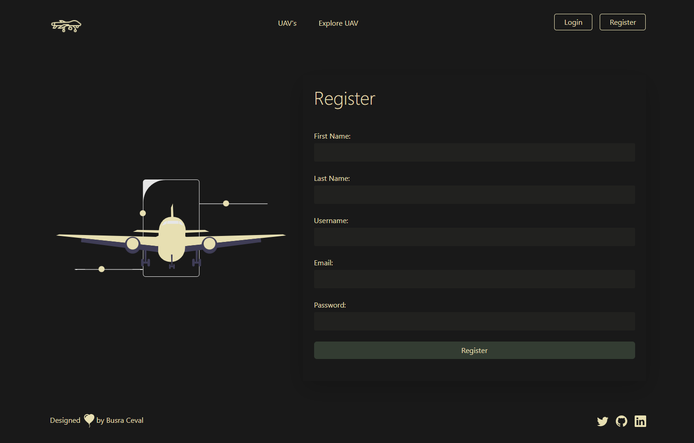
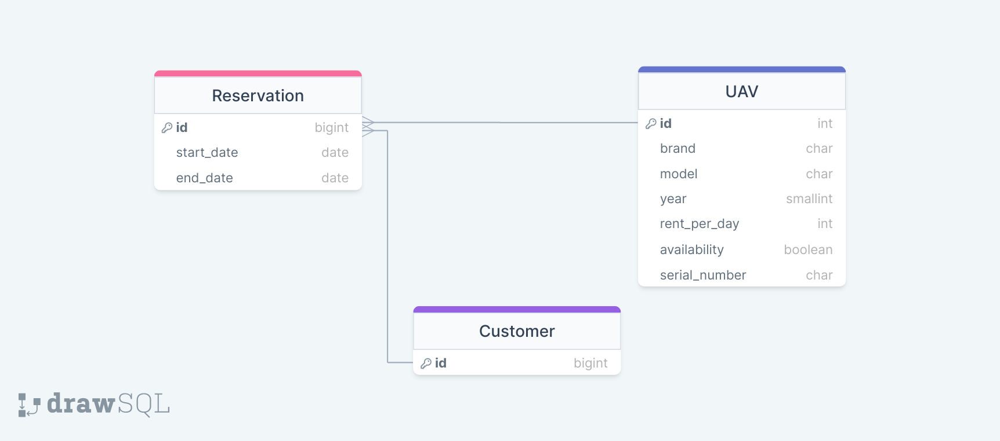

<h1> Django & React UAV Projects</h1>
  

# Rent a UAV App

Rent a uav app enables customers to rent uavs between start and end date of their reservation.

## Used Technologies

- For BackendEnd;

  - Python
  - Django
  - Django Rest Framework
  - Python Decouple
  - Dango Rest Auth
  - Django Filter
  - Python Coverage
  - Django Swagger
  - Django Logging
     

- For FrontEnd;

  - Bootstrap 5
  - Axios
  - JavaScript
  - CSS
  - JSX
  - React
  - React Context API
  - React Router @6.3
  - Toastify
  - yarn
  - Formik
  - Yup
     

- For Database;

  - PostgreSQL
  - SQLite
     

- Extracts;
  - Docker version 6.3
  - Git
  - Github
  - Scrum

  

## ERD

- SWAGGER LINK : http://127.0.0.1:8000/swagger
- REDOC LINK : http://127.0.0.1:8000/redoc
- .ENV : https://drive.google.com/file/d/11992RgQEomkGo-30F2eSuFjpcg-5JvYU/view?usp=sharing

  

## BackEnd Tasks

- Customers (normal user);

  - can select start and end date and see the list of available uavs on selected dates. It is not allowed to choose past dates.
  - can choose a uav on the list and reserve that uav, but can not reserve more than one uav on a selected time period,
  - can not reserve uavs which are reserved by other customers on selected time period.
  - can see the list of their reservations including past ones.
  - can update reservations.
  - can delete their reservations.

- Admins (staff user);

  - can make CRUD operations on uav table,
  - can make CRUD operations on Customers table,
  - can make CRUD operations on Reservations table,

- Owner (super user);

  - can access everything

- There are filtering, pagination, and sorting capabilities on list views.

---

## FrontEnd Tasks

- There are Login, Logout UAV listing, UAV Search and Filtering, UAV Detail and profile pages.
- Let me push later as there is a time limit

---

**
&#9786; Happy Coding! &#9997;
**

Busra Ceval

